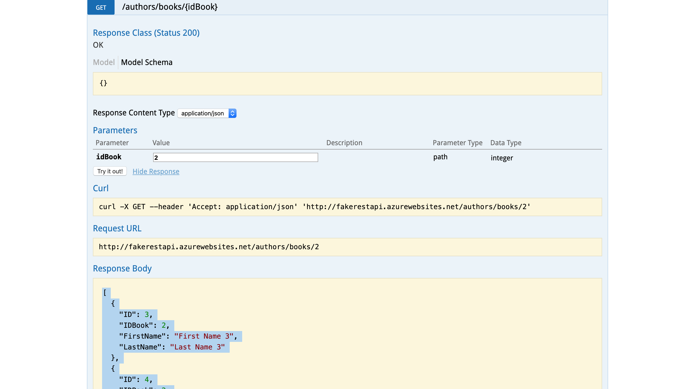
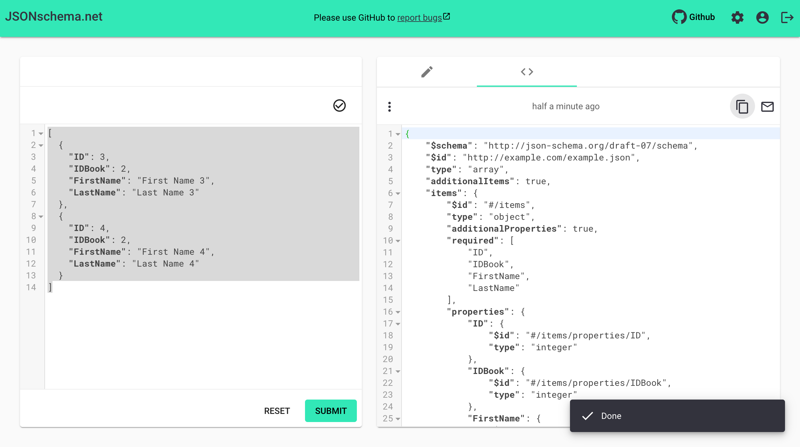

#### [<< Back](../docs)

# How to Create the Test

### Dummy Sample REST API
- http://fakerestapi.azurewebsites.net/swagger
- Endpoint: http://fakerestapi.azurewebsites.net/authors/books/2

### Create the Page file
1. Go to folder `api`
2. Create a file page with name from path endpoint
3. `api/authors/books.js`

```javascript
const supertest = require('supertest');
require('dotenv').config();

const api = supertest(process.env.FAKERESTAPI_BASE_URL);

const getBooksId = (idBook) => api.get(`/authors/books/${idBook}`)
	.set('Accept', 'application/json');

module.exports = {
	getBooksId
};
```

4. Create a file JSON Schema from the response
5. `data/authors/get_books_id_schema.json`
6. Copy the response from the swagger page of the endpoint



7. Go to https://jsonschema.net/
8. Paste the response and submit to generate the schema



9. Copy the schema JSON and paste on file previously

```json
{
    "$schema": "http://json-schema.org/draft-07/schema",
    "$id": "http://example.com/example.json",
    "type": "array",
    "additionalItems": true,
    "items": {
        "$id": "#/items",
        "type": "object",
        "additionalProperties": true,
        "required": [
            "ID",
            "IDBook",
            "FirstName",
            "LastName"
        ],
        "properties": {
            "ID": {
                "$id": "#/items/properties/ID",
                "type": "integer"
            },
            "IDBook": {
                "$id": "#/items/properties/IDBook",
                "type": "integer"
            },
            "FirstName": {
                "$id": "#/items/properties/FirstName",
                "type": "string"
            },
            "LastName": {
                "$id": "#/items/properties/LastName",
                "type": "string"
            }
        }
    }
}
```

10. Create a file test with name from path endpoint
11. `test/authors/get_books_id_test.js`

```javascript
const assert = require('chai').expect;
const chai = require('chai');
chai.use(require('chai-json-schema'));

const code = require('../../helper/response.json');
const { getBooksId } = require('../../api/authors/books');
const schemaUsers = require('../../data/authors/get_books_id_schema.json');

const idBook = 2, wrongId = 1, invalidId = 'abc123';

const testCase = {
	describe: 'FakeRestAPI.Web - Get Books by ID | [GET] /authors/books/{idBook}',
	describePositive: 'Positive Testing',
	describeNegative: 'Negative Testing',
	positive: {
		getBooksId: `As a User, I should be able to successfully get the books using valid id ${idBook}`
	},
	negative: {
		wrongId: `As a User, I should not be able to successfully get the books using wrong id ${wrongId}`,
		invalidId: `As a User, I should not be able to successfully get the books using invalid id ${invalidId}`
	}
};

describe(`@getBooksIdTest ${testCase.describe}`, () => {
	describe(`${testCase.describePositive}`, () => {
		it(`@get @getBooksId ${testCase.positive.getBooksId}`, async() => {
			const response = await getBooksId(idBook);
			assert(response.status).to.equal(code.success.ok, response.body.message);
			assert(response.body).to.be.jsonSchema(schemaUsers);
		});
	});
	describe(`${testCase.describeNegative}`, () => {
		it(`@get @wrongId ${testCase.negative.wrongId}`, async() => {
			const response = await getBooksId(wrongId);
			assert(response.status).to.equal(code.success.ok, response.body.message);
		});
		it(`@get @invalidId ${testCase.negative.invalidId}`, async() => {
			const response = await getBooksId(invalidId);
			assert(response.status).to.equal(code.error.notFound, response.body.message);
		});
	}); 
}); 

```

12. Adding variable on .env file

```sh
REQRES_BASE_URL=https://reqres.in
FAKERESTAPI_BASE_URL=http://fakerestapi.azurewebsites.net

DB_HOST=127.0.0.1
DB_USERNAME=admin
DB_PASSWORD=admin
DB_PORT=3306
DB_DATABASE=coba1
```

### How to Run

```sh
- npm run test-api -- --grep @getBooksIdTest					| Only tag name @getBooksIdTest
- npm run test-api -- --grep @skip --invert						| All test with no have tag name @skip
- npm run test-api -- --grep @skip --invert && npm run grafana	| All test with integration Grafana (insert report file to the database)
```