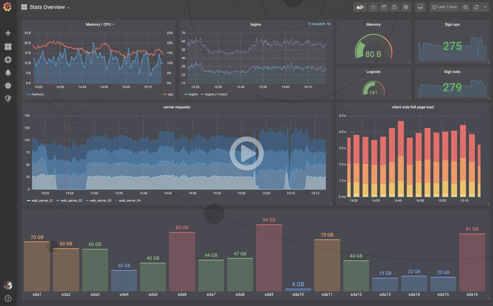
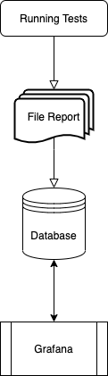

#### [<< Back](../docs)

# How to Integrate with Grafana
Grafana adalah sebuah software opensource yang membaca sebuah data matrics untuk dibuat menjadi sebuah grafik atau sebuah data tertulis. Grafana banyak sekali digunakan untuk melakukan analisis data dan monitoring. Grafana mendukung banyak storage backends yang berbeda untuk data time series (Source Data). https://tncdigitalmedia.com/perangkat-lunak/open-source/grafana-software-opensource-yang-powerful-untuk-analisis-data-dan-monitoring

[](https://grafana.com/video/visualize.mp4)

https://grafana.com/

### Grafana Process


### Description
API testing ini menggunakan reporter dari module mochawesome, dan file reporter tersimpan didalam folder `reports/mochawesome/`. File terdiri dari `mochawesome.html`, `mochawesome.json` dan file pendukung html. Setiap melakukan running testing, maka tergenerate kedua file tersebut berdasarkan hasil testing.

Di software Grafana support di beberapa database, seperti: PostgreSQL, Microsoft SQL Server (MSSQL), OpenTSDB, MySQL, dan sebagainya.

> Bagaimana cara report testing disimpan didalam database, yang nanti akan dibaca Grafana untuk dibuat menjadi sebuah grafik atau data tertulis (monitoring)?

Logika sederhana:
1. Membaca file mochawesome.json
2. Mengambil `key` yang informatif
3. `key` disimpan didalam database
4. Grafana melakukan query ke database
5. Grafana menampilkan data report testing

Solusi:
Diperlukan fungsi yang dapat membaca file json, kemudian dilakukan proses query `insert`. Untuk proses query bisa menggunakan fungsi yang digunakan proses Seed Data. Maka dibuat fungsi sederhana dengan nodejs sebagai berikut:

File `reports/grafana.js`
```javascript
const jsonfile = require('jsonfile');

const file = __dirname + '/mochawesome/mochawesome.json';

const { executeSql } = require('../seed_data/sql_page');

let stats, timeStart, timeEnd, startDate, endDate;

jsonfile.readFile(file, async function(err, obj) {
	if (err) throw(err);
	stats = obj.stats;

	startDate = obj.stats.start.split('T');
	timeStart = startDate[1].split('.');
	endDate = obj.stats.end.split('T');
	timeEnd = endDate[1].split('.');

	startDate = startDate[0] + ' ' + timeStart[0];
	endDate = endDate[0] + ' ' + timeEnd[0];

	const sql = `INSERT INTO mochawesome (name, suites, tests, passes, pending, failures, start, end, duration, testsRegistered, passPercent, pendingPercent, other, hasOther, skipped, hasSkipped, created_at) VALUES ("test", ${stats.suites}, ${stats.tests}, ${stats.passes}, ${stats.pending}, ${stats.failures}, "${startDate}", "${endDate}", ${stats.duration}, ${stats.testsRegistered}, ${stats.pendingPercent}, ${stats.pendingPercent}, ${stats.other}, "${stats.hasOther}", ${stats.skipped}, "${stats.hasSkipped}", "${startDate}");`;
	await executeSql(sql);
});
```