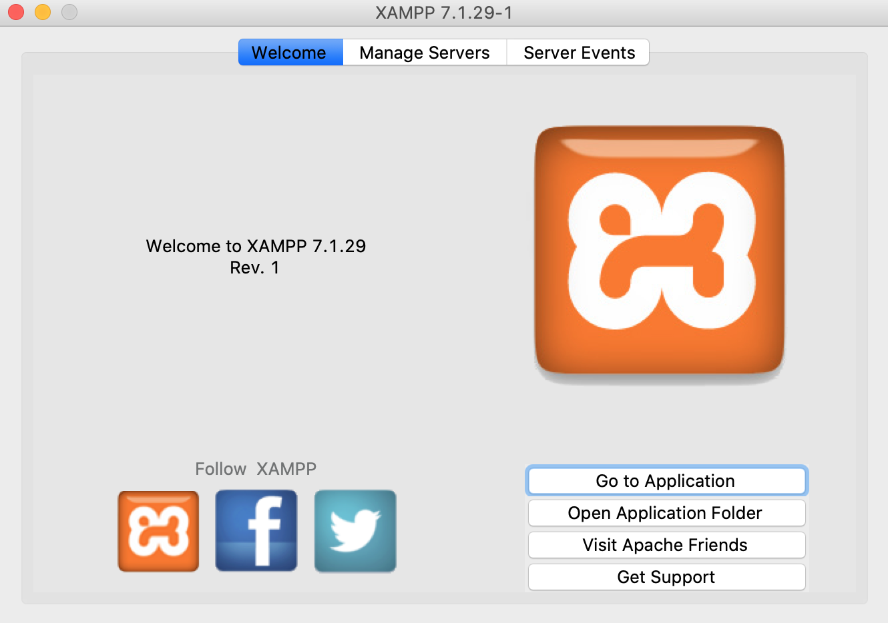
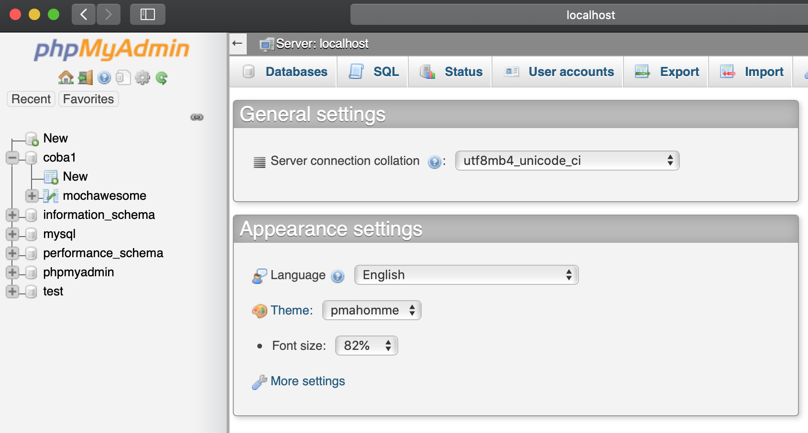
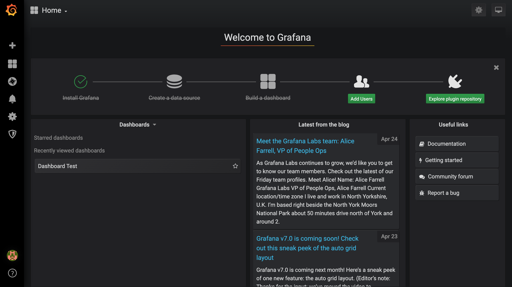
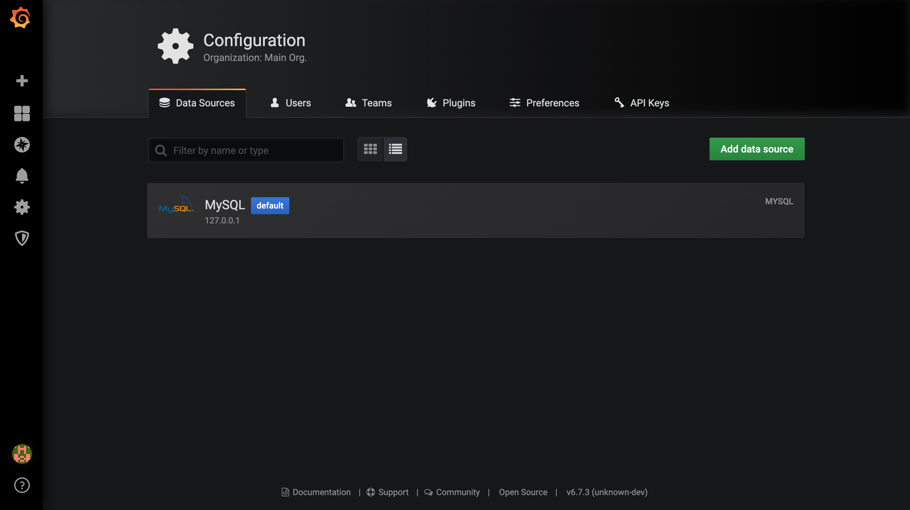
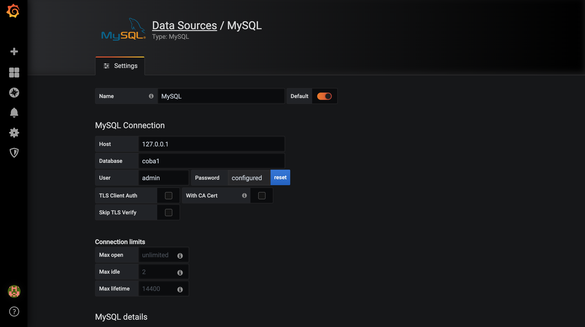
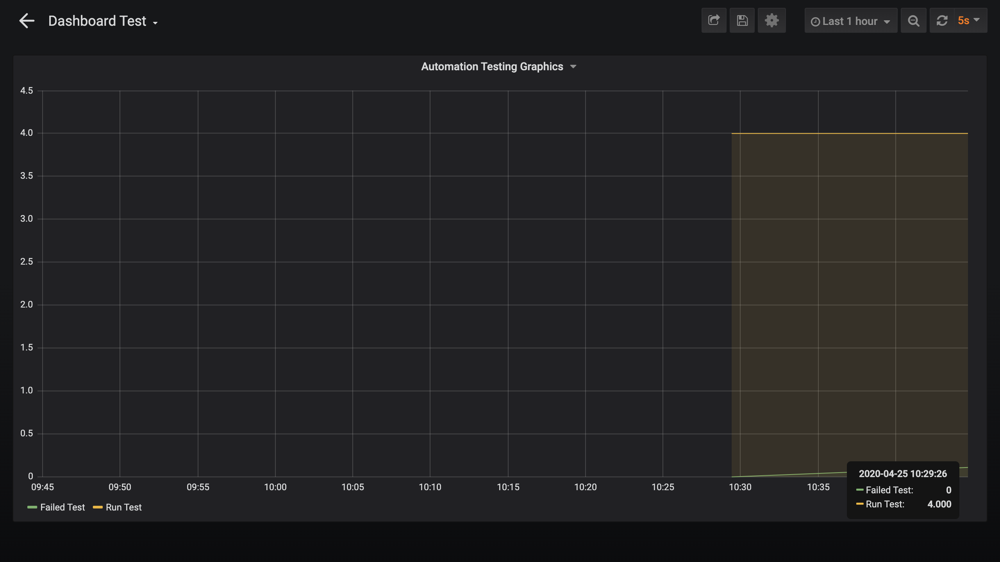

#### [<< Back](../docs)

# How to Integrate with Grafana
Grafana adalah sebuah software opensource yang membaca sebuah data matrics untuk dibuat menjadi sebuah grafik atau sebuah data tertulis. Grafana banyak sekali digunakan untuk melakukan analisis data dan monitoring. Grafana mendukung banyak storage backends yang berbeda untuk data time series (Source Data). https://tncdigitalmedia.com/perangkat-lunak/open-source/grafana-software-opensource-yang-powerful-untuk-analisis-data-dan-monitoring

[](https://grafana.com/video/visualize.mp4)

https://grafana.com/

### Grafana Process


### Inserting the report in the database

#### File `reports/grafana.js`

```javascript
const jsonfile = require('jsonfile');

const file = __dirname + '/mochawesome/mochawesome.json';

const { executeSql } = require('../seed_data/sql_page');

let stats, timeStart, timeEnd, startDate, endDate;

jsonfile.readFile(file, async function(err, obj) {
	if (err) throw(err);
	stats = obj.stats;

	startDate = obj.stats.start.split('T');
	timeStart = startDate[1].split('.');
	endDate = obj.stats.end.split('T');
	timeEnd = endDate[1].split('.');

	startDate = startDate[0] + ' ' + timeStart[0];
	endDate = endDate[0] + ' ' + timeEnd[0];

	const sql = `INSERT INTO mochawesome (name, suites, tests, passes, pending, failures, start, end, duration, testsRegistered, passPercent, pendingPercent, other, hasOther, skipped, hasSkipped, created_at) VALUES ("test", ${stats.suites}, ${stats.tests}, ${stats.passes}, ${stats.pending}, ${stats.failures}, "${startDate}", "${endDate}", ${stats.duration}, ${stats.testsRegistered}, ${stats.pendingPercent}, ${stats.pendingPercent}, ${stats.other}, "${stats.hasOther}", ${stats.skipped}, "${stats.hasSkipped}", "${startDate}");`;
	await executeSql(sql);
});
```

### Database
#### using XAMPP


- Download https://www.apachefriends.org/download.html
- Install xampp desktop
- Star Server MySQL Database and Apache Web Server

#### mysql phpmyadmin
```sh
http://localhost/phpmyadmin
```

Default
- Host http://localhost / http://127.0.0.1
- Username admin
- Password admin
- Port 3306



#### Create table
```sql
CREATE TABLE `mochawesome` (
  `id` int(6) NOT NULL,
  `name` varchar(50) NOT NULL,
  `suites` int(6) NOT NULL,
  `tests` int(6) NOT NULL,
  `passes` int(6) NOT NULL,
  `pending` int(6) NOT NULL,
  `failures` int(6) NOT NULL,
  `start` varchar(50) NOT NULL,
  `end` varchar(50) NOT NULL,
  `duration` int(6) NOT NULL,
  `testsRegistered` int(6) NOT NULL,
  `passPercent` decimal(5,2) NOT NULL,
  `pendingPercent` int(6) NOT NULL,
  `other` int(11) NOT NULL,
  `hasOther` varchar(25) NOT NULL,
  `skipped` int(11) NOT NULL,
  `hasSkipped` varchar(25) NOT NULL,
  `created_at` timestamp NOT NULL DEFAULT CURRENT_TIMESTAMP ON UPDATE CURRENT_TIMESTAMP
) ENGINE=InnoDB DEFAULT CHARSET=latin1;
```

### Installation Grafana

#### Download and install
OS X(via Homebrew):

```sh
brew update
brew install grafana
```

#### Start Grafana
Start Grafana using Homebrew services:

```sh
brew services start grafana
```

#### Go to Grafana Dashboard
```sh
http://localhost:3000/login
```
Email: admin / Password: admin

#### Setup Grafana Dashboard



1. Go to Configuration - Data Source
2. And choose MySQL



3. Settings the MySQL Connection



4. Create the dashboard, and setup the panel
5. And add Query

```sql
select created_at as time,
failures as "Failed Test"
from mochawesome
where name = 'test'
group by created_at;
```

```sql
select created_at as time,
tests as "Run Test"
from mochawesome
where name = 'test'
group by created_at;
```

6. Save



### How to Run - Integrate
1. package.json > scripts > `"grafana": "node reports/grafana.js",`

```json
{
  "name": "mochaiwithsupertest",
  "version": "1.0.0",
  "description": "Boilerplate Automation Testing API",
  "main": "index.js",
  "scripts": {
    "test-api": "./node_modules/mocha/bin/mocha ./test --recursive --reporter mochawesome --reporter-options reportDir=reports/mochawesome/ --timeout 180000 --exit",
    "grafana": "node reports/grafana.js",
```

2. Run

```sh
$ npm run test-api -- --grep @skip --invert && npm run grafana
```

Reference:
- https://grafana.com/docs/grafana/latest/installation/mac/
